## Abstract

This experiment focuses on the familiarization of different types of antennas and their basic operation in wireless communication systems. 
The activity aims to help students understand how antennas function as both transmitting (TX) and receiving (RX) devices in the propagation of electromagnetic waves. 
Various antenna types were examined and connected to the experimental setup to observe their performance during signal transmission and reception.

## Theoretical Background
Antennas are essential components in wireless communication systems that convert electrical signals into electromagnetic waves and vice versa. When an antenna is connected to a transmitter (TX), it radiates electromagnetic energy into free space. Conversely, when connected to a receiver (RX), the antenna captures electromagnetic waves and converts them back into electrical signals that can be processed by the receiving system.
Different types of antennas are designed to operate efficiently at specific frequency ranges and radiation patterns. Some antennas radiate signals in all directions (omnidirectional), while others focus energy in specific directions (directional). The characteristics of an antenna such as gain, radiation pattern, polarization, and operating frequency influence its effectiveness in transmitting and receiving signals.
In practical communication systems, antennas are used in pairs where one antenna acts as the transmitter and another as the receiver. The performance of signal transmission depends on several factors including antenna alignment, distance between antennas, frequency of operation, and surrounding environmental conditions.
By familiarizing with different antenna types and using them alternately as transmitting and receiving devices, students can observe how electromagnetic waves propagate through space and understand the fundamental principles of antenna operation and wireless signal communication.

## Different Types of Antennas

### Transmitting Mast 

A transmitting mast is a structural support designed to elevate an antenna above the ground or surrounding obstacles. Its primary function is to ensure that the antenna can transmit electromagnetic waves effectively over a greater distance with minimal interference or signal blockage. By raising the antenna, the mast reduces the impact of obstructions such as buildings, trees, or other structures, which can absorb or reflect electromagnetic waves and degrade signal quality.

In wireless communication systems, the height and stability of the transmitting mast directly influence the strength and clarity of the transmitted signal. Higher placement typically increases the line-of-sight coverage area and reduces multipath interference caused by reflections. The mast also ensures that the antenna maintains the correct orientation and alignment, which is crucial for directional antennas or experiments where precise radiation patterns are studied.

During the experiment, the transmitting mast was used to mount different types of antennas serving as transmitters (TX). This allowed students to observe how antenna height, position, and alignment affect the propagation of signals to the receiving antenna (RX). The experiment demonstrated that even small changes in antenna placement on the mast could influence the received signal strength, confirming the importance of proper mast design and installation in practical communication systems.

    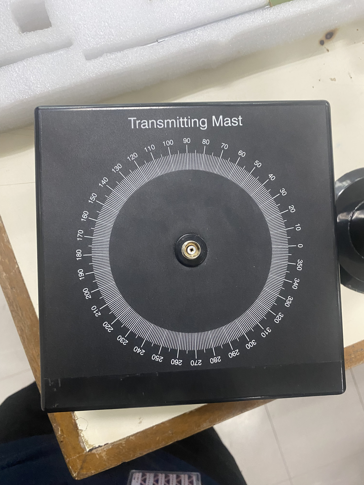

### Matching Stub

A matching stub is used in antenna systems to match the impedance of the transmission line with the antenna, ensuring maximum power transfer and minimizing reflections. Without proper matching, part of the transmitted signal is reflected back toward the source, increasing the Voltage Standing Wave Ratio (VSWR) and reducing system efficiency.

In the antenna trainer experiment, different types of stubs, such as short-circuited or open-circuited stubs, were connected at specific points along the transmission line. By adjusting the length and position of the stub, students were able to achieve better impedance matching, which was observed as a reduction in reflected power and a lower VSWR.

This experiment allows students to understand the practical application of transmission line theory and the importance of impedance matching in antenna systems. Proper use of matching stubs improves signal strength, radiation efficiency, and overall performance of wireless communication setups.

    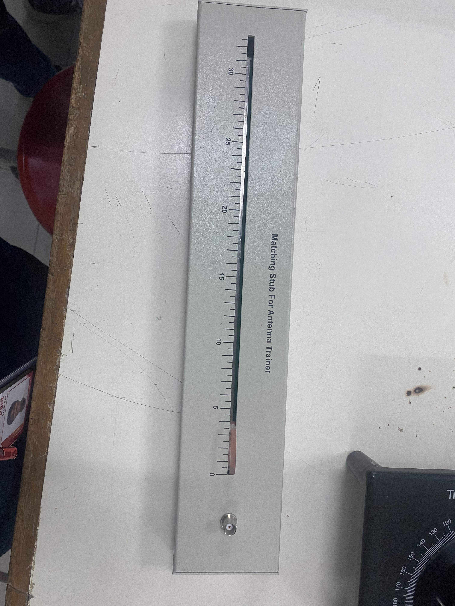

### 5-Element Yagi-Uda Antenna (Folded Dipole)

The 5-Element Yagi-Uda antenna is a **directional antenna** commonly used for television reception, point-to-point communication, and amateur radio. It consists of a **folded dipole as the driven element**, one **reflector**, and three **directors**, all mounted along a boom. The folded dipole improves impedance matching, typically around 300 Ω, making it easier to connect to standard transmission lines.

Key specifications include:  
- **Number of elements:** 5 (1 folded dipole, 1 reflector, 3 directors)  
- **Frequency range:** VHF/UHF bands depending on element lengths  
- **Gain:** Moderate to high, due to directional focus  
- **Front-to-back ratio:** Enhanced by reflector to reduce signal from unwanted directions  
- **Radiation pattern:** Highly directional with narrow beamwidth  

The reflector reflects energy toward the front of the antenna, while the directors focus the radiated energy, resulting in **increased directivity and gain**. The spacing and lengths of the elements are carefully calculated relative to the operating wavelength to optimize performance. This type of antenna is widely used in applications where **signal strength in a specific direction is required** and interference from other directions needs to be minimized.

    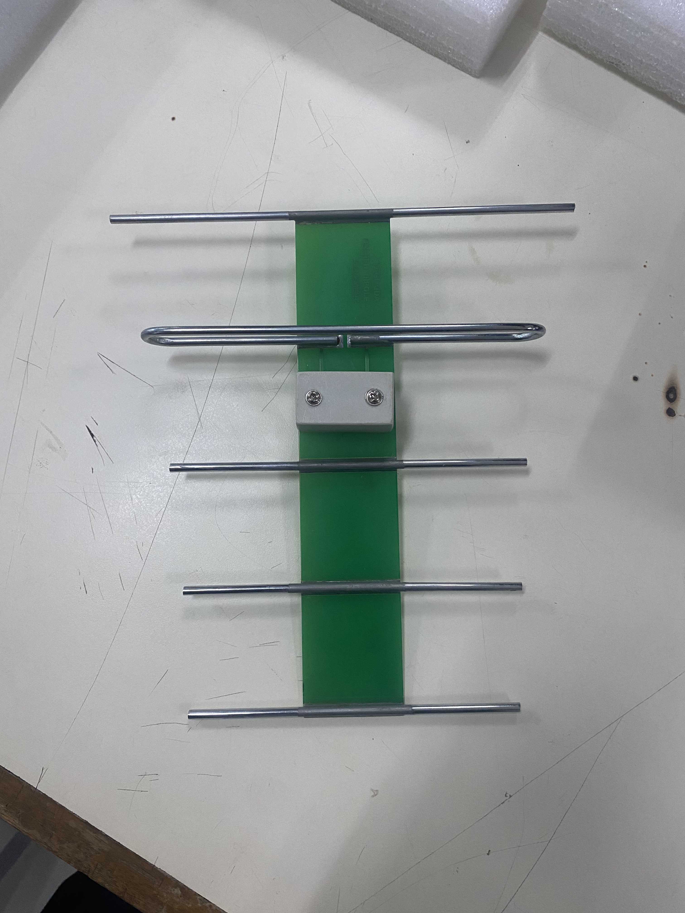

### Telescopic Monopole Antenna

The telescopic monopole antenna is a **vertically oriented, single-element antenna** commonly used for portable communication devices, radio receivers, and field measurements. It consists of a conductive rod mounted over a **ground plane**, with the ability to extend or retract to adjust its resonant frequency.

Key specifications include:  
- **Type:** Monopole, single element  
- **Length:** Adjustable (typically 0.5–2 meters) to tune to different frequencies  
- **Frequency range:** VHF/UHF depending on rod extension  
- **Impedance:** Approximately 50 Ω for standard matching  
- **Radiation pattern:** Omni-directional in the horizontal plane  
- **Polarization:** Vertical  

The telescopic design allows the antenna to be compact for storage and portable use, while providing tunability to different operational frequencies. Its omni-directional radiation pattern ensures that signals are transmitted or received equally in all horizontal directions, making it ideal for applications where the direction of the signal source is unknown or variable. The monopole requires a proper ground plane for efficient operation, as the ground plane acts as a reflective surface to complete the antenna’s radiating structure.

    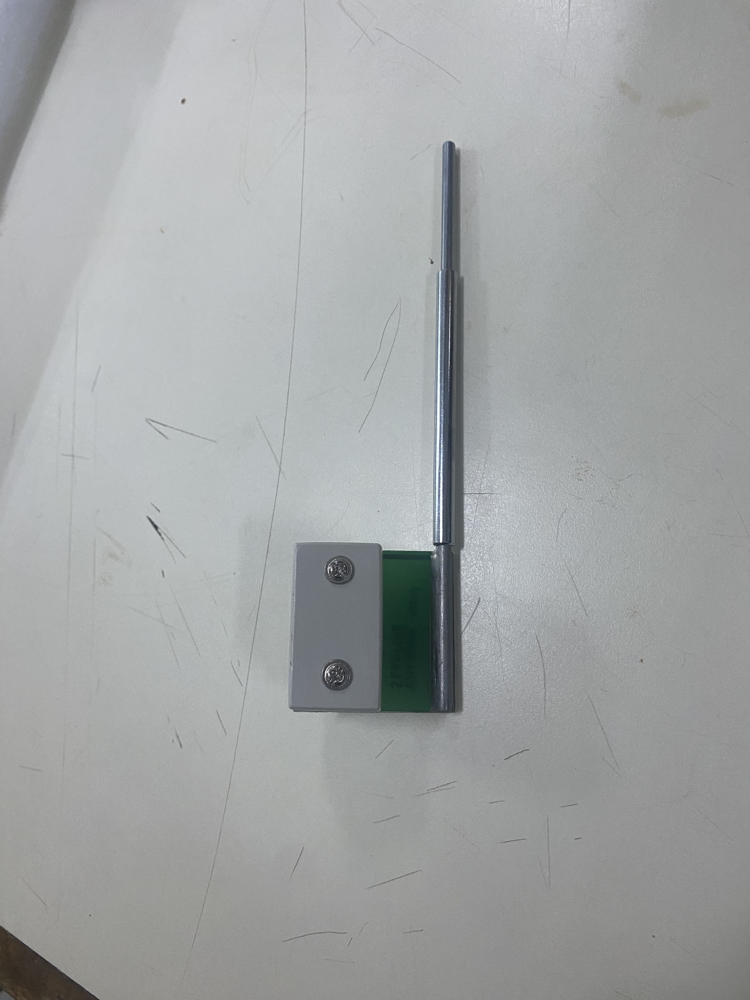

### Folded Dipole with Detector Antenna

The Folded Dipole with Detector Antenna is a **variation of the standard dipole antenna** that uses a folded conductor to improve impedance characteristics and facilitate connection to measurement or detection equipment. The folded dipole design increases the feed-point impedance, making it easier to match with standard transmission lines and sensitive detectors.

Key specifications include:  
- **Type:** Folded dipole  
- **Configuration:** Two parallel conductors connected at both ends  
- **Frequency range:** Designed for VHF/UHF bands depending on element length  
- **Impedance:** Typically around 300 Ω (higher than a standard dipole)  
- **Radiation pattern:** Broadside, similar to a standard dipole  
- **Use case:** Acts as a detector for signal strength or measurement in laboratory setups  

The folded dipole’s higher impedance and wide bandwidth make it ideal for use with detectors and measurement instruments, providing more accurate readings of received signal strength. Its simple design ensures that it can be used as a **sensitive receiver element** while maintaining a predictable radiation pattern and polarization. This type of antenna is commonly used in antenna trainers and experimental setups to observe and measure electromagnetic wave behavior.

    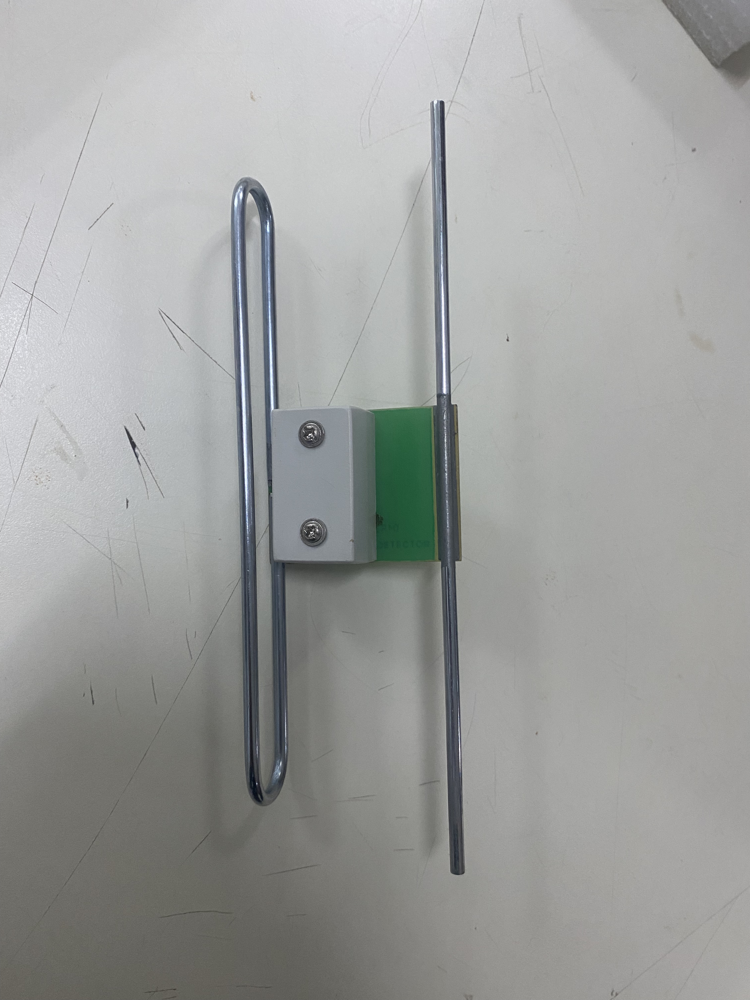

### Slot Antenna

The slot antenna is a type of antenna in which a slot is cut into a conductive surface or ground plane to radiate electromagnetic waves. It operates on the principle of **complementarity** to a dipole antenna, meaning that the slot’s radiation characteristics mirror those of a standard dipole of equivalent dimensions.

Key specifications include:  
- **Type:** Slot / planar antenna  
- **Configuration:** Rectangular or linear slot cut in a conductive sheet  
- **Frequency range:** Determined by the slot length; typically used in VHF/UHF bands  
- **Impedance:** Typically 50 Ω when designed for standard transmission line matching  
- **Radiation pattern:** Broadside to the plane of the slot  
- **Polarization:** Linear, determined by the slot orientation  
- **Applications:** Radar systems, microwave communication, and experimental antenna studies  

Slot antennas are widely used in applications where a **low-profile and planar design** is required. They provide predictable radiation patterns and are suitable for integration with other planar structures. The antenna’s performance depends on the slot dimensions, thickness of the conductive sheet, and the surrounding ground plane, making them ideal for controlled laboratory experiments and compact communication devices.

    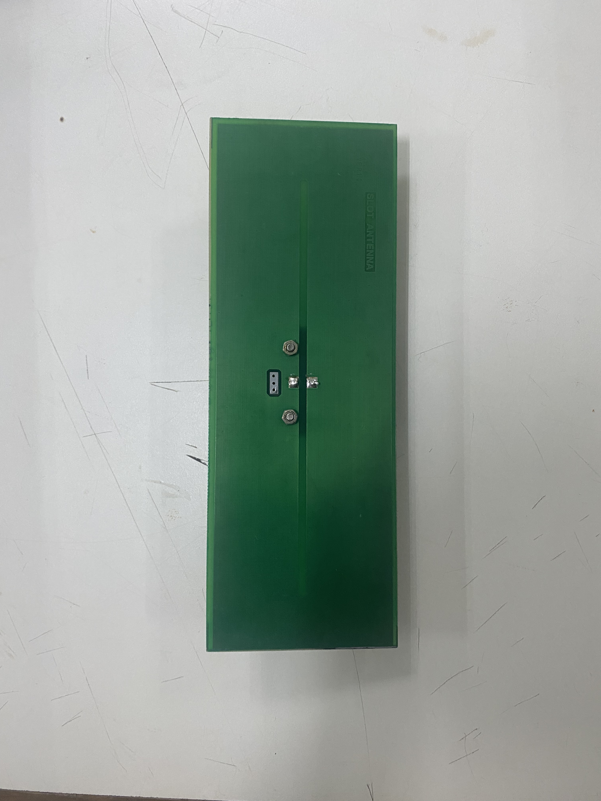

### Combined Collinear Array Antenna

The Combined Collinear Array Antenna is a **high-gain, vertically polarized antenna** consisting of multiple dipole elements stacked in a collinear arrangement. Each element is fed in phase to reinforce radiation along the main axis, resulting in increased gain and a narrow vertical beamwidth while maintaining an omnidirectional pattern in the horizontal plane.

Key specifications include:  
- **Type:** Collinear array  
- **Configuration:** Multiple dipole elements stacked vertically and connected in phase  
- **Frequency range:** VHF/UHF, depending on element length and spacing  
- **Impedance:** Typically 50 Ω when properly matched  
- **Radiation pattern:** Omnidirectional in the horizontal plane, narrow vertical beamwidth  
- **Applications:** FM broadcasting, mobile communication, and base station antennas  

The collinear design enhances directivity and overall gain without sacrificing horizontal coverage, making it ideal for communication systems that require long-range coverage with uniform signal distribution in all directions horizontally. Proper phasing and element spacing are critical to optimize performance and minimize interference or nulls in the radiation pattern.

    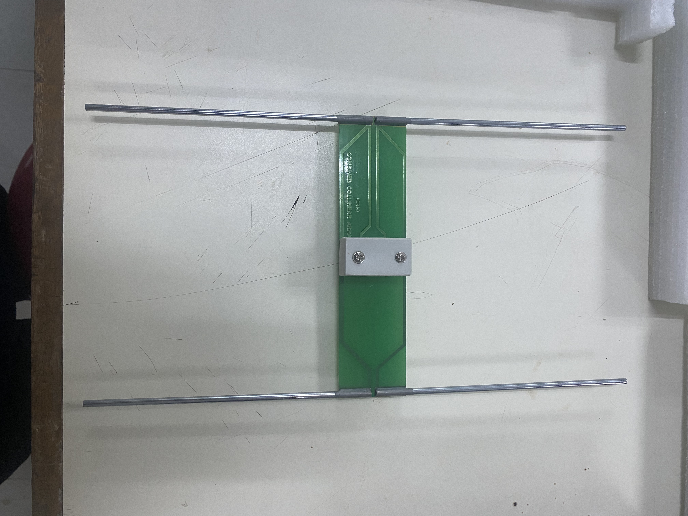

### Dipole Antenna (1/4 λ)

The Dipole Antenna with a quarter-wavelength (1/4 λ) design is one of the simplest and most widely used antennas in communication systems. It consists of a single radiating element that is typically mounted over a ground plane, functioning as a monopole antenna with an effective length equal to one-quarter of the operating wavelength.

Key specifications include:  
- **Type:** Quarter-wavelength monopole/dipole  
- **Length:** λ/4 of the operating frequency  
- **Frequency range:** Determined by element length; typically used in VHF/UHF bands  
- **Impedance:** Approximately 36–50 Ω when mounted over a proper ground plane  
- **Radiation pattern:** Omni-directional in the horizontal plane  
- **Polarization:** Vertical  
- **Applications:** Mobile communications, FM broadcasting, simple wireless systems  

The 1/4 λ dipole is compact yet effective, providing an omnidirectional horizontal radiation pattern, which makes it suitable for applications where the direction of the signal source is variable or unknown. Proper mounting above a ground plane is necessary to ensure efficient radiation and impedance matching. Its simplicity and predictable characteristics make it ideal for laboratory demonstrations and practical communication setups.

    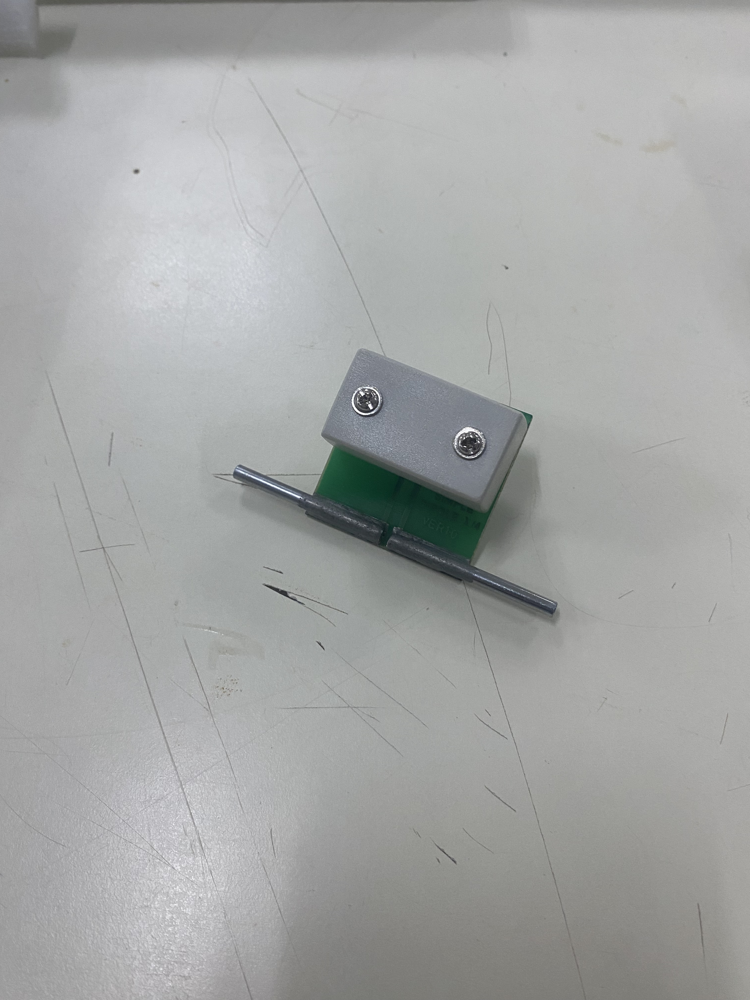

### Ground Plane

A ground plane is a conductive surface or network used as a **reference for antennas**, particularly for monopole or quarter-wavelength dipole designs. It acts as a reflective surface, effectively creating an image of the antenna to complete the radiating structure, which improves radiation efficiency and stabilizes impedance.

Key specifications and features include:  
- **Type:** Conductive plate or wire radials  
- **Configuration:** Typically a circular or square metal sheet, or multiple radial wires extending from the antenna base  
- **Frequency range:** Can be designed for VHF, UHF, or microwave bands depending on antenna dimensions  
- **Impedance impact:** Helps maintain approximately 50 Ω for standard monopoles  
- **Radiation pattern:** Omni-directional in the horizontal plane  
- **Applications:** Monopole antennas, quarter-wavelength dipoles, portable and fixed communication systems  

The ground plane ensures that the monopole or dipole antenna radiates efficiently and exhibits predictable characteristics. Its size, shape, and number of radials influence the antenna’s impedance, bandwidth, and radiation pattern. Ground planes are essential in both laboratory setups and practical communication installations to provide a stable reference and improve overall antenna performance.

    

### Simple Dipole for Paraboloid Reflector

A simple dipole used with a paraboloid reflector acts as the **feed antenna** in a parabolic dish system. The dipole radiates electromagnetic waves, which are then reflected and focused by the parabolic surface to produce a highly directional beam with high gain. This combination is widely used in satellite communication, radar, and point-to-point microwave links.

Key specifications and features include:  
- **Type:** Half-wave dipole (1/2 λ)  
- **Configuration:** Positioned at the focal point of the paraboloid reflector  
- **Frequency range:** Depends on the dipole and reflector dimensions; typically VHF/UHF or microwave bands  
- **Impedance:** Approximately 73 Ω for a free-space half-wave dipole; matched to 50 Ω via feed design  
- **Radiation pattern:** Highly directional due to reflector focusing, narrow beamwidth  
- **Applications:** Satellite communication, radar systems, high-gain point-to-point links  

The paraboloid reflector amplifies the dipole’s radiation by reflecting the emitted waves into a concentrated beam, significantly increasing antenna gain and directivity. The placement and alignment of the dipole at the reflector’s focal point are critical to achieve maximum efficiency and minimize signal loss or sidelobes. This type of antenna setup demonstrates the principles of **antenna gain enhancement and beam focusing** in practical communication systems.

    

### Simple Dipole (λ/2)

The Simple Dipole (half-wavelength) is one of the most fundamental and widely used antennas in radio and communication systems. It consists of two conductive elements with a total length equal to half the wavelength (λ/2) of the operating frequency, fed at the center with a balanced transmission line.

Key specifications and features include:  
- **Type:** Half-wave dipole  
- **Length:** λ/2 of the operating frequency  
- **Frequency range:** Determined by element length; commonly used in VHF/UHF bands  
- **Impedance:** Approximately 73 Ω in free space; can be matched to 50 Ω using a balun  
- **Radiation pattern:** Broadside, with maximum radiation perpendicular to the axis of the dipole  
- **Polarization:** Linear  
- **Applications:** Broadcasting, point-to-point communication, and as a feed element for larger antennas (e.g., Yagi, parabolic reflector)  

The half-wave dipole offers predictable radiation characteristics and is often used as a reference antenna in laboratory and field experiments. Its simple design allows easy calculation of element length for a desired frequency, while providing an efficient and reliable radiation pattern for practical communication applications.

    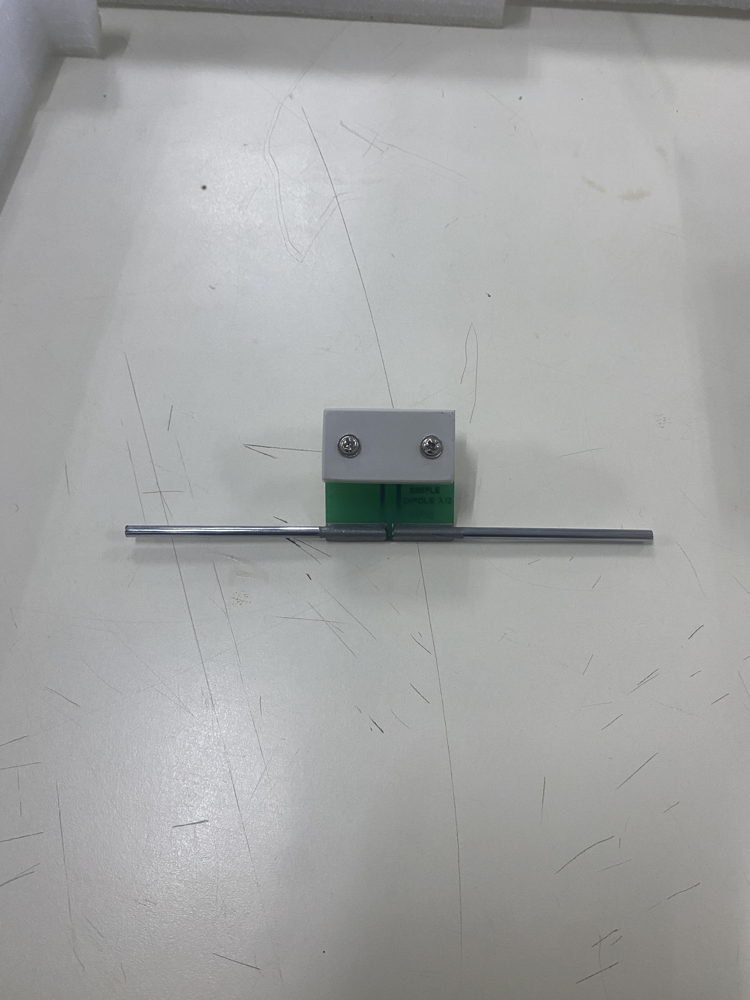

### Dipole Antenna (3/2 λ)

The Dipole Antenna with a length of three-halves wavelength (3/2 λ) is an extended version of the standard half-wave dipole, providing **multiple radiation lobes** and higher gain along specific directions. It is primarily used in applications where increased directivity or specific radiation patterns are required.

Key specifications and features include:  
- **Type:** Multi-lobed dipole  
- **Length:** 3/2 of the operating wavelength (λ)  
- **Frequency range:** Determined by the element length; commonly used in VHF/UHF bands  
- **Impedance:** Varies with multiple lobes; typically requires matching for 50 Ω systems  
- **Radiation pattern:** Multiple main lobes with nulls between lobes; more directional than λ/2 dipole  
- **Polarization:** Linear  
- **Applications:** Antenna arrays, directional communication, and experimental studies in radiation patterns  

The 3/2 λ dipole produces **additional lobes** compared to the half-wave dipole, which allows the antenna to radiate in multiple preferred directions. Its design illustrates how increasing antenna length relative to wavelength affects radiation characteristics, directivity, and impedance, making it useful for both **practical applications and educational demonstrations** of antenna theory.

    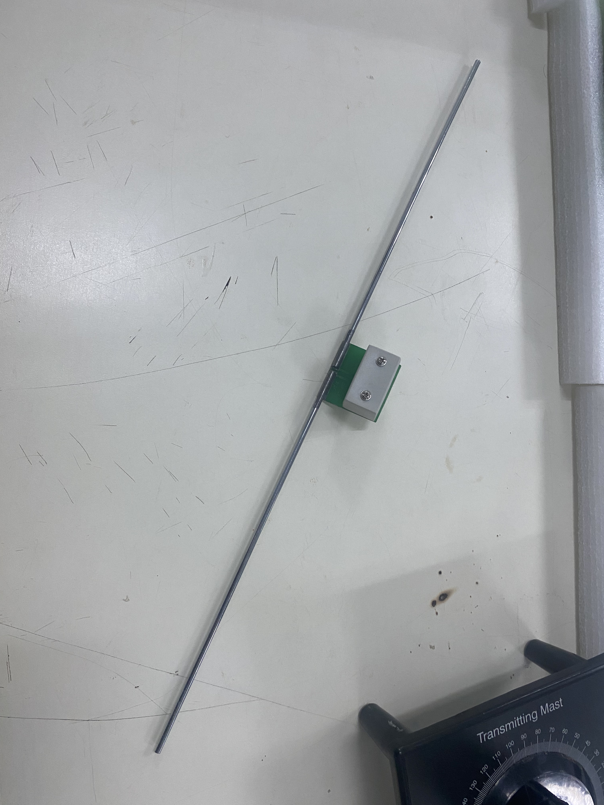

### Phased Array 2-Element (1/4 λ) Antenna

The Phased Array 2-Element Antenna with quarter-wavelength (λ/4) spacing is a simple **directional array antenna** consisting of two elements fed with a controlled phase difference to steer the main lobe in a desired direction. This design demonstrates the principle of beamforming and constructive/destructive interference in antenna arrays.

Key specifications and features include:  
- **Type:** 2-element phased array  
- **Element length:** 1/4 λ each  
- **Element spacing:** 1/4 λ between elements  
- **Frequency range:** Determined by element length; typically VHF/UHF bands  
- **Impedance:** Requires careful matching depending on phase shift  
- **Radiation pattern:** Directional with a main lobe determined by phase difference; reduced sidelobes compared to single elements  
- **Applications:** Beam steering, experimental studies of phased arrays, directional communication  

The 2-element phased array demonstrates how **phase differences between elements** can control the direction of maximum radiation. By adjusting the relative phase, the antenna can steer its main beam without physically moving the structure. This principle is widely used in modern radar, wireless communication, and adaptive antenna systems for **enhanced directivity and signal control**.

    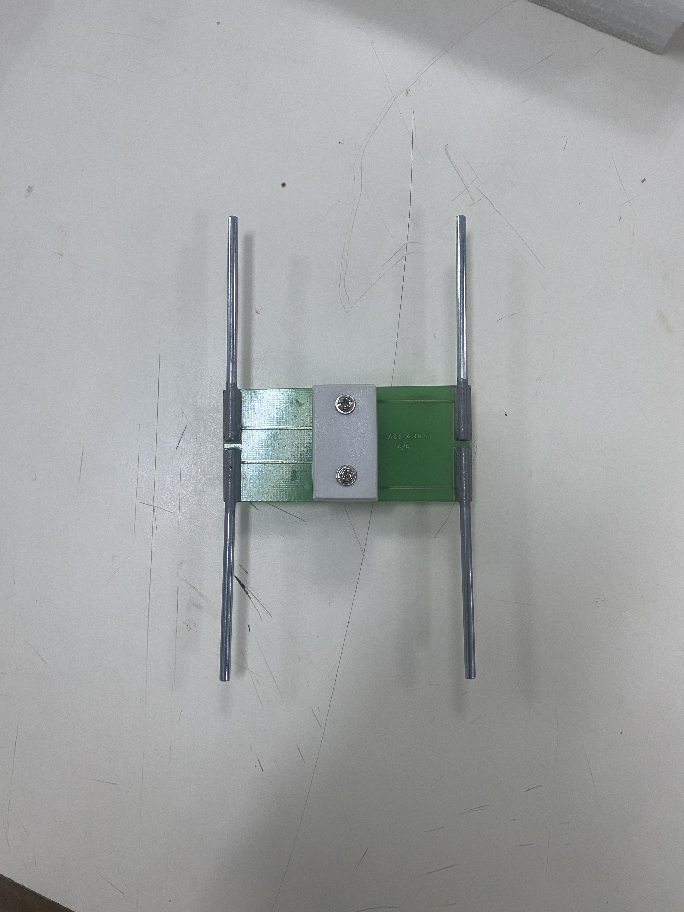

### Yagi-Uda Antenna (Simple 5 Elements)

The Yagi-Uda antenna with 5 elements is a **directional antenna** widely used in television reception, point-to-point communication, and amateur radio. It consists of a **driven element (dipole), a reflector, and three directors**, arranged along a boom to focus radiated energy in a single direction, increasing gain and directivity.

Key specifications and features include:  
- **Type:** Directional Yagi-Uda antenna  
- **Number of elements:** 5 (1 driven element, 1 reflector, 3 directors)  
- **Frequency range:** Typically VHF/UHF, depending on element lengths  
- **Impedance:** Approximately 50–75 Ω, depending on the driven element design  
- **Radiation pattern:** Highly directional with a main lobe along the boom axis and reduced back radiation  
- **Gain:** Moderate to high, improved by multiple directors  
- **Applications:** TV reception, long-range communication, and experimental directional antenna studies  

The Yagi-Uda design enhances forward radiation while minimizing backward radiation. Directors focus the energy, and the reflector improves the front-to-back ratio. Proper element spacing and sizing are essential to achieve the desired gain, beamwidth, and impedance characteristics, making it an effective and widely adopted antenna for **directional communication applications**.

    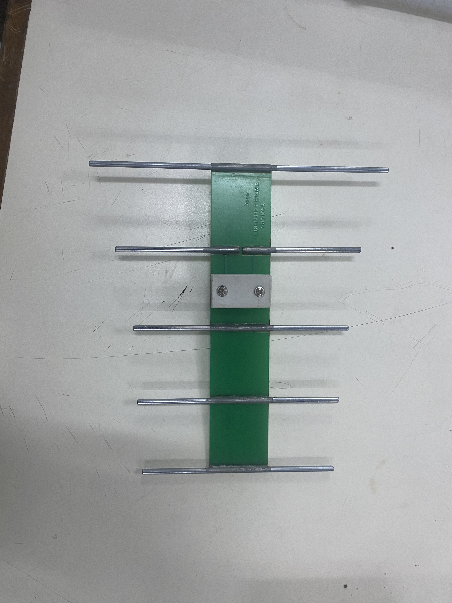

### Quarter-Wave Monopole Antenna

The Quarter-Wave Monopole Antenna is one of the simplest and most widely used antennas in wireless communication. It consists of a **single vertical conductor** mounted over a conductive ground plane, with a length equal to **one-quarter of the operating wavelength (λ/4)**. The ground plane acts as a reflective surface, effectively forming a virtual image of the antenna to complete the radiating structure.

Key specifications and features include:  
- **Type:** Monopole antenna  
- **Length:** λ/4 of the operating frequency  
- **Frequency range:** Determined by element length; commonly VHF/UHF bands  
- **Impedance:** Approximately 36–50 Ω when mounted over an adequate ground plane  
- **Radiation pattern:** Omni-directional in the horizontal plane  
- **Polarization:** Vertical  
- **Applications:** Mobile communication, FM broadcasting, and portable wireless systems  

The quarter-wave monopole provides a **compact and efficient design** with predictable radiation characteristics. Its omnidirectional horizontal pattern makes it ideal for applications where the direction of signal reception or transmission is variable. Proper use of a ground plane is essential for efficient radiation and impedance matching.

    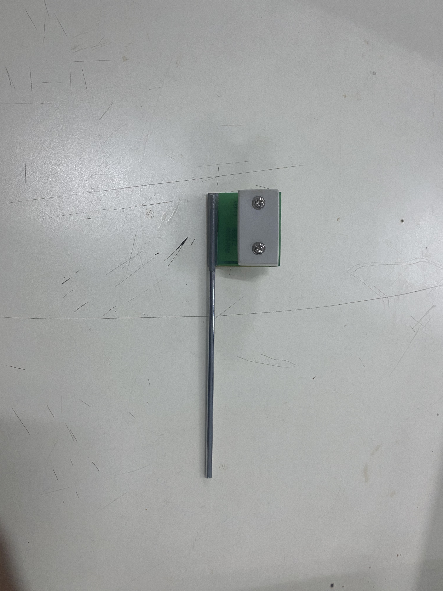

### Loop Antenna

The Loop Antenna is a type of **resonant antenna** in which the conductor forms a closed loop, typically circular, square, or rectangular. It is widely used for receiving signals in AM radio, direction finding, and experimental studies due to its compact size and predictable radiation characteristics.

Key specifications and features include:  
- **Type:** Resonant loop antenna  
- **Configuration:** Single-turn or multi-turn conductive loop  
- **Frequency range:** Determined by the loop circumference; typically VLF, LF, MF, or HF bands  
- **Impedance:** Varies depending on loop size and turns; often matched using tuning networks  
- **Radiation pattern:** Broadside for small loops, directional along the plane of the loop for large loops  
- **Polarization:** Linear, depending on orientation  
- **Applications:** AM reception, signal direction finding, and laboratory antenna experiments  

Loop antennas can be designed as **small loops** (circumference << λ) for high selectivity and low signal capture, or **resonant loops** (circumference ≈ λ) for efficient radiation and reception. They are particularly useful in applications where **compact size and controlled directionality** are desired.

    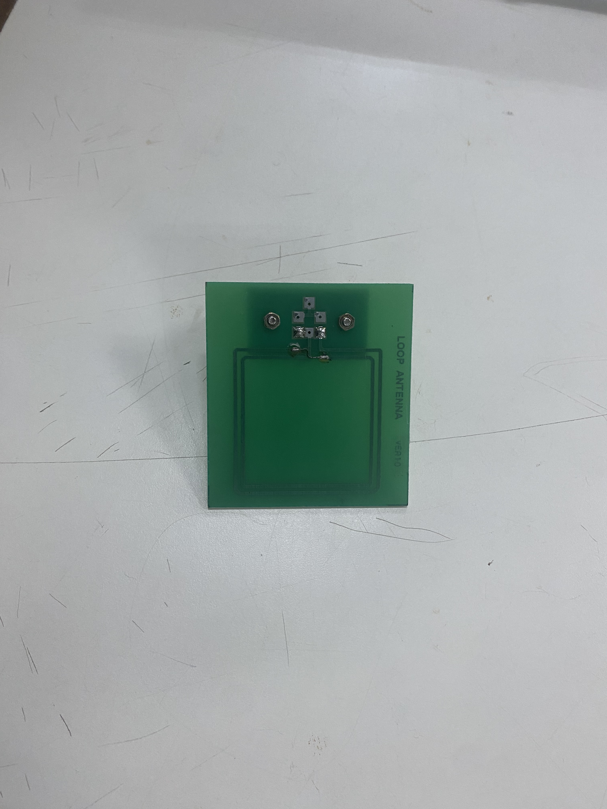

### Yagi-Uda Antenna (Folded Dipole, 3 Elements)

The Yagi-Uda Antenna with a folded dipole as the driven element and three elements is a **compact directional antenna** commonly used in VHF/UHF communication and signal reception. The folded dipole improves impedance matching, while the reflector and single director focus the radiation to enhance directivity and gain.

Key specifications and features include:  
- **Type:** Directional Yagi-Uda antenna  
- **Number of elements:** 3 (1 folded dipole as driven element, 1 reflector, 1 director)  
- **Frequency range:** Typically VHF/UHF, depending on element lengths  
- **Impedance:** Approximately 300 Ω for folded dipole; can be matched to 50 Ω with a matching network  
- **Radiation pattern:** Directional along the boom axis, with a main lobe forward and reduced back radiation  
- **Gain:** Moderate, higher than a single dipole due to additional elements  
- **Applications:** TV reception, point-to-point communication, and experimental directional antenna studies  

The folded dipole serves as the main radiating element, while the reflector and director shape the radiation pattern for **enhanced forward gain** and improved front-to-back ratio. Proper spacing and element length are critical to maximize antenna efficiency and achieve the desired directivity.

    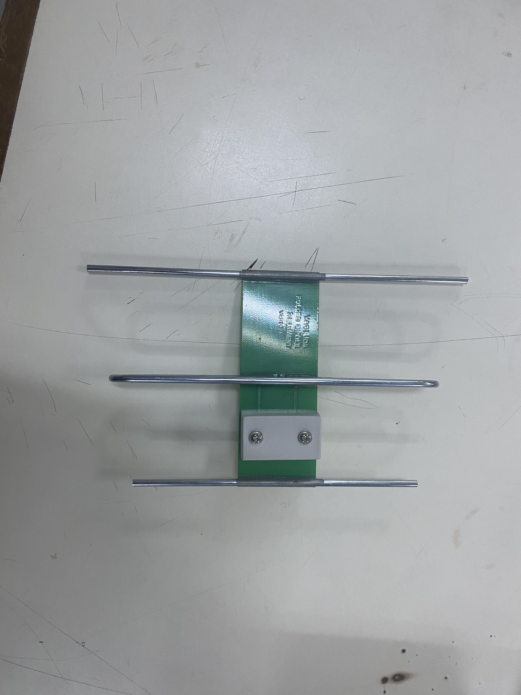

### Phased Array Antenna (λ/2)

The Phased Array Antenna with half-wavelength (λ/2) element spacing is a **directional array antenna** where multiple elements are arranged in a line and fed with controlled phase differences to steer the main beam in a desired direction. This design demonstrates the principle of **beamforming** for enhanced directivity and gain.

Key specifications and features include:  
- **Type:** Linear phased array  
- **Element length:** λ/2 for each radiating element  
- **Element spacing:** λ/2 between elements  
- **Frequency range:** Determined by element length; typically VHF/UHF bands  
- **Impedance:** Requires matching depending on the number of elements and phase shift  
- **Radiation pattern:** Highly directional along the array axis; beam direction controlled by phase difference  
- **Applications:** Radar systems, beam steering, directional communication, and antenna array studies  

The λ/2 spacing allows the array to achieve **constructive interference in the desired direction** while minimizing grating lobes, providing precise beam control. Phased arrays are widely used in **modern communication and radar systems** where electronically controlled directionality is required without physically moving the antenna.

    

### Microstrip Patch Antennas (Planar Radiators)

Microstrip Patch Antennas are **planar antennas** consisting of a thin metallic patch mounted over a grounded dielectric substrate. They are widely used in modern wireless communication due to their **compact size, low profile, and ease of fabrication**. The patch acts as a resonator, radiating electromagnetic waves from its edges.

Key specifications and features include:  
- **Type:** Planar microstrip patch antenna  
- **Configuration:** Metallic patch (rectangular, circular, or other shapes) over a dielectric substrate with ground plane  
- **Frequency range:** Typically UHF to microwave bands, depending on patch dimensions and substrate  
- **Impedance:** Usually designed for 50 Ω feed  
- **Radiation pattern:** Broadside, generally directional perpendicular to the patch  
- **Polarization:** Linear (can be circular with special design)  
- **Applications:** Mobile devices, GPS, Wi-Fi, satellite communication, and IoT systems  

Microstrip patch antennas provide **lightweight, low-cost, and easily integrated solutions** for modern wireless applications. Their planar structure makes them suitable for conformal or embedded designs, and careful selection of patch dimensions and substrate material allows optimization of resonance, gain, and bandwidth.

    

### Broadside Array Antenna

The Broadside Array Antenna is a **linear array of radiating elements** designed to produce maximum radiation perpendicular to the axis of the array. All elements are fed **in phase**, which creates a strong **broadside main lobe** and provides high directivity in the perpendicular direction.

Key specifications and features include:  
- **Type:** Linear broadside array  
- **Element configuration:** Multiple identical elements arranged along a line  
- **Element spacing:** Typically λ/2 to avoid grating lobes  
- **Frequency range:** Determined by the operating wavelength of the elements; commonly used in VHF/UHF bands  
- **Impedance:** Requires proper matching depending on number of elements and feed network  
- **Radiation pattern:** Maximum radiation perpendicular to the array axis (broadside); reduced radiation along the axis  
- **Applications:** Broadcasting, radar, directional communication, and experimental array studies  

Broadside arrays allow **enhanced gain** and a controlled radiation pattern while keeping the beam direction fixed perpendicular to the array. Proper spacing and phasing of elements are critical to optimize the **main lobe and minimize sidelobes**, making them suitable for applications that require **uniform directional coverage**.

    

### Yagi-Uda Antenna (Simple 7 Elements)

The Yagi-Uda Antenna with 7 elements is a **directional antenna** widely used in television reception, point-to-point communication, and amateur radio. It consists of a **driven element (dipole), one reflector, and five directors** arranged along a boom to focus energy in a single direction, enhancing gain and directivity.

Key specifications and features include:  
- **Type:** Directional Yagi-Uda antenna  
- **Number of elements:** 7 (1 driven element, 1 reflector, 5 directors)  
- **Frequency range:** Typically VHF/UHF, depending on element lengths  
- **Impedance:** Approximately 50–75 Ω depending on the driven element design  
- **Radiation pattern:** Highly directional with main lobe along the boom axis and reduced back radiation  
- **Gain:** High, due to multiple directors focusing energy forward  
- **Applications:** TV reception, long-range point-to-point communication, and experimental directional antenna studies  

The multiple directors increase the forward gain and improve the **front-to-back ratio**, reducing interference from signals coming from unwanted directions. Proper element spacing and sizing are crucial for maximizing efficiency, achieving the desired radiation pattern, and minimizing impedance mismatch.

    

### Folded Dipole Antenna

The Folded Dipole Antenna is a variation of the standard dipole where **two parallel conductive elements** are connected at both ends. This design increases the feed-point impedance, making it easier to match with standard transmission lines and providing broader bandwidth compared to a single dipole.

Key specifications and features include:  
- **Type:** Folded dipole  
- **Configuration:** Two parallel conductors connected at both ends, fed at the center  
- **Frequency range:** Determined by the total length of the dipole; commonly used in VHF/UHF bands  
- **Impedance:** Approximately 300 Ω, easily matched to 50 Ω using a balun or matching network  
- **Radiation pattern:** Broadside, similar to a standard dipole  
- **Polarization:** Linear  
- **Applications:** TV and FM reception, antenna arrays, feed element for Yagi-Uda antennas, and laboratory studies  

The folded dipole offers **improved impedance matching and wider bandwidth** while maintaining predictable radiation characteristics. It is commonly used as a **driven element in Yagi-Uda antennas** and other directional arrays for enhanced performance.

    

### Periodic Antenna

A Periodic Antenna is a type of antenna structure composed of **repeated elements arranged periodically** along a line or surface. The periodic arrangement allows the antenna to exhibit **specific radiation characteristics**, such as beam shaping, frequency selectivity, and enhanced directivity, based on the spacing and number of elements.

Key specifications and features include:  
- **Type:** Linear or planar periodic array  
- **Element configuration:** Identical elements repeated at uniform intervals  
- **Element spacing:** Typically λ/2 or designed according to desired beam properties  
- **Frequency range:** Determined by element length and spacing; commonly VHF, UHF, or microwave bands  
- **Impedance:** Depends on the number of elements and feed structure; requires matching for standard transmission lines  
- **Radiation pattern:** Can be directional or broadside depending on design; beam direction controlled by element phase and spacing  
- **Applications:** Beamforming arrays, phased array antennas, radar systems, and experimental antenna studies  

Periodic antennas allow **precise control of the main lobe and sidelobes** through element spacing and phasing. They are widely used in **modern communication and radar systems** to enhance gain, steer beams, and create desired radiation patterns without physically moving the antenna.

    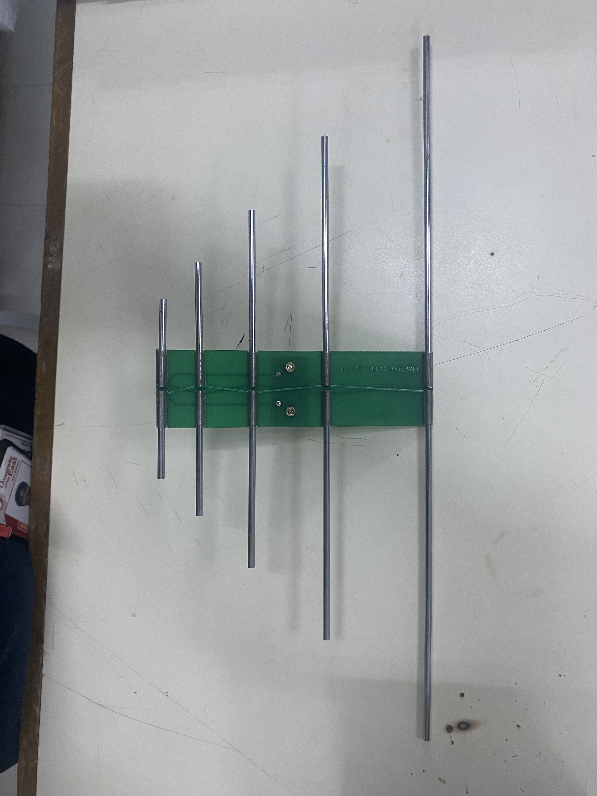

### Rhombus Antenna

The Rhombus Antenna is a **high-gain directional wire antenna** with a diamond-shaped (rhombus) configuration. It consists of long, sloping wires forming a rhombus, supported by poles or masts at the corners. This antenna is designed to provide **broad bandwidth, high directivity, and low vertical angle radiation**, making it ideal for long-distance HF communication.

Key specifications and features include:  
- **Type:** Wire directional antenna  
- **Configuration:** Four wires forming a rhombus, typically fed at one corner with a transmission line  
- **Frequency range:** Typically HF bands (3–30 MHz), depending on rhombus dimensions  
- **Impedance:** Depends on wire length, rhombus shape, and height above ground; often matched using a transformer or matching network  
- **Radiation pattern:** Directional along the long axis of the rhombus, with low-angle radiation for long-distance transmission  
- **Applications:** Long-distance HF communication, amateur radio DXing, and point-to-point HF links  

The rhombus design provides **high gain over a wide bandwidth** with a relatively simple structure. Its directional characteristics and low-angle radiation make it suitable for **skip-distance or skywave propagation** where long-distance coverage is required.

    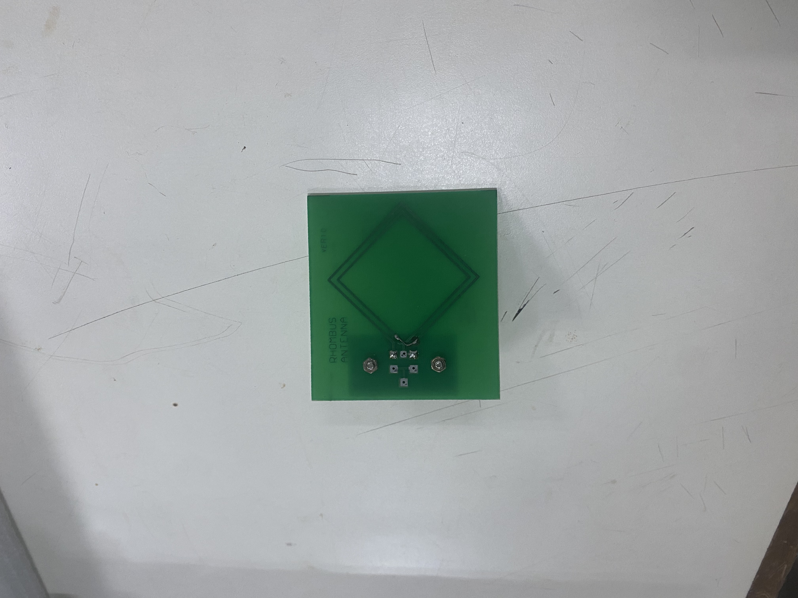

### Yagi-Uda Antenna Feed and Connector Setup

The image shows a **Yagi-Uda antenna** mounted on a support structure with a **coaxial feed connection**. The driven element of the antenna is connected to a transmission line via a **BNC or UHF connector**, allowing signals to be transmitted to or received from the antenna. This type of setup is commonly used for **directional signal experiments, laboratory measurements, and point-to-point communication systems**.

Key specifications and features include:  
- **Antenna type:** Yagi-Uda, directional  
- **Mounting:** Elevated on a metallic support rod to reduce ground interference  
- **Feed mechanism:** Coaxial cable with BNC/UHF connectors for reliable connection  
- **Purpose:** Transmit and receive RF signals with minimal loss and clear directional pattern  
- **Applications:** Signal propagation studies, directional communication experiments, antenna testing  

The connector setup ensures **stable electrical contact** and proper impedance matching, which is critical for reducing reflections and maintaining signal integrity. The Yagi-Uda’s directional elements work in conjunction with this feed to produce a **focused radiation pattern**, maximizing gain in the desired direction.

    

### Matching Stub for Antenna Trainer

The image shows a **Matching Stub** connected to a transmitting mast and other RF components in an antenna training setup. A matching stub is used to **adjust impedance between the antenna and transmission line**, ensuring maximum power transfer and reducing signal reflections. It typically consists of a **movable shorting element along a transmission line**, allowing students to experiment with impedance matching for various antenna types.

Key specifications and features include:  
- **Type:** Adjustable matching stub for antenna training  
- **Purpose:** Impedance matching between antenna and transmission line  
- **Configuration:** Movable shorting element along a graduated line for fine-tuning  
- **Applications:** Laboratory antenna experiments, learning impedance matching, and RF signal optimization  
- **Integration:** Works with transmitting masts, directional antennas, and receiver units  

The matching stub allows users to observe **how adjusting the stub position affects signal transmission and reflection**, providing hands-on understanding of antenna impedance and VSWR (Voltage Standing Wave Ratio) in practical RF systems.

    

### Folded Dipole Receiver Setup

The image shows a Folded Dipole Antenna connected to an oscilloscope in a receiver training setup. The folded dipole is designed to **receive RF signals efficiently**, providing a simple yet effective way to observe waveform characteristics on a measurement device. This setup allows students to explore **signal reception, polarization effects, and waveform analysis.**

Key specifications and features include:
- **Type:** Folded dipole receiver antenna
- **Purpose:** Capture RF signals for oscilloscope observation
- **Configuration:** Mounted on a stand with adjustable orientation for polarization testing
- **Applications:** Laboratory experiments for learning signal reception, waveform visualization, and antenna theory
- **Integration:** Works with transmitting masts, signal generators, and oscilloscope measurement tools

This receiver setup allows users to observe how the antenna captures signals from a transmitter, visualize them on an oscilloscope, and analyze waveform characteristics such as amplitude, frequency, and noise. It provides a practical introduction to antenna behavior, signal propagation, and RF measurement techniques.

  

### RF Detector Setup

The image shows an RF Detector connected to a measurement device in a laboratory setup. The RF detector is designed to **detect and measure RF signals efficiently**, providing a simple yet effective way to observe signal characteristics from various RF sources. This setup allows students to explore **signal strength, waveform behavior, and source localization.**

Key specifications and features include:  
- **Type:** RF Detector Module  
- **Purpose:** Capture RF signals for measurement and analysis  
- **Configuration:** Mounted on a stand or breadboard with probe connections for easy testing  
- **Applications:** Laboratory experiments for learning RF detection, signal visualization, and antenna testing  
- **Integration:** Works with transmitting antennas, signal generators, and measurement instruments  

This RF detector setup allows users to observe how the module responds to RF sources, visualize signals on connected devices, and analyze characteristics such as amplitude, frequency, and noise. It provides a practical introduction to **RF sensing, signal propagation, and measurement techniques.**

  

### Receiving Mast Setup

The image shows a Receiving Mast connected to a measurement device in a laboratory setup. The receiving mast is designed to **support multiple antennas and improve signal capture**, providing a stable and adjustable platform for observing RF signals from various sources. This setup allows students to explore **signal reception, antenna orientation effects, and waveform analysis.**

Key specifications and features include:  
- **Type:** Adjustable receiving mast  
- **Purpose:** Hold antennas for optimal RF signal reception  
- **Configuration:** Mounted with adjustable height and rotation for testing polarization and directionality  
- **Applications:** Laboratory experiments for learning antenna placement, signal capture, and propagation analysis  
- **Integration:** Works with various receiving antennas, signal generators, and measurement devices  

This receiving mast setup allows users to observe how antenna height and orientation affect signal strength, visualize captured waveforms on measurement devices, and analyze RF propagation characteristics. It provides a practical introduction to **antenna support structures, reception techniques, and experimental RF analysis.**

  

